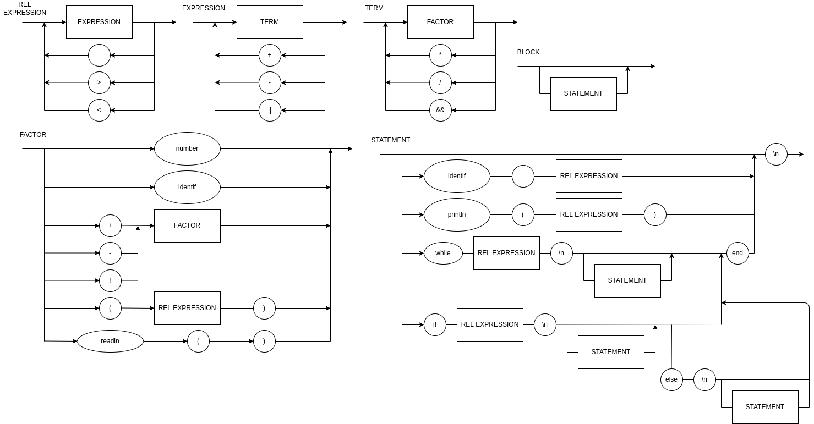

# compilador-logicomp

### EBNF

BLOCK = { STATEMENT };

STATEMENT = ( 
    λ | 
    ASSIGNMENT | 
    PRINT |
    "while", REL_EXPRESSION, "\n", { STATEMENT }, "end" |
    "if", REL_EXPRESSION, "\n", { STATEMENT }, (λ | ("else", "\n", { STATEMENT })), "end"
    ),
    "\n";

ASSIGNMENT = IDENTIFIER, "=", REL_EXPRESSION ;

PRINT = "println", "(", REL_EXPRESSION, ")" ;

REL_EXPRESSION = EXPRESSION, { ("==" | ">" | "<"), EXPRESSION } ;

EXPRESSION = TERM, { ("+" | "-" | "||"), TERM } ;

TERM = FACTOR, { ("*" | "/" | "&&"), FACTOR } ;

FACTOR = (("+" | "-" | "!"), FACTOR) | NUMBER | "(", REL_EXPRESSION, ")" | IDENTIFIER | "readln","(",")" ;

IDENTIFIER = LETTER, { LETTER | DIGIT | "_" } ;

NUMBER = DIGIT, { DIGIT } ;

LETTER = ( a | ... | z | A | ... | Z ) ;

DIGIT = ( 1 | 2 | 3 | 4 | 5 | 6 | 7 | 8 | 9 | 0 ) ;