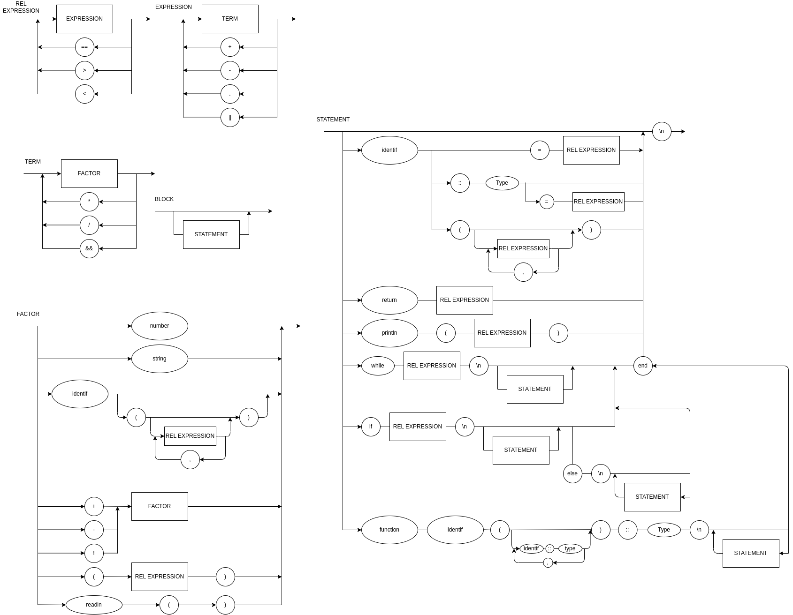

# compilador-logicomp

### EBNF

BLOCK = { STATEMENT };

STATEMENT = ( 
    λ | 
    ASSIGNMENT | 
    CALL_FUNC |
    DEF_FUNC |
    PRINT |
    "while", REL_EXPRESSION, "\n", { STATEMENT }, "end" |
    "if", REL_EXPRESSION, "\n", { STATEMENT }, {"else", "\n", { STATEMENT }}, "end"
    ),
    "\n";

ASSIGNMENT = IDENTIFIER, ("::", TYPING), ("=", REL_EXPRESSION) ;

CALL_FUNC = IDENTIFIER, "(", {REL_EXPRESSION, ","} ,")"

DEF_FUNC = "function", IDENTIFIER, "(", {REL_EXPRESSION, "::", TYPING ","} ,")", "::", TYPING, "\n", { STATEMENT }

PRINT = "println", "(", REL_EXPRESSION, ")" ;

REL_EXPRESSION = EXPRESSION, { ("==" | ">" | "<"), EXPRESSION } ;

EXPRESSION = TERM, { ("+" | "-" | "||" | "."), TERM } ;

TERM = FACTOR, { ("*" | "/" | "&&"), FACTOR } ;

FACTOR = (
    (("+" | "-" | "!"), FACTOR) |
    NUMBER |
    STRING |
    "(", REL_EXPRESSION, ")" |
    IDENTIFIER, ["(", {REL_EXPRESSION, ","} ,")"] |
    "readln","(",")"
    );

STRING = '"' + {ALL_CHARACTERS} + '"' ;

ALL_CHARACTERS = ? all visible characters ? ;

IDENTIFIER = LETTER, { LETTER | DIGIT | "_" } ;

NUMBER = DIGIT, { DIGIT } ;

LETTER = ( a | ... | z | A | ... | Z ) ;

DIGIT = ( 1 | 2 | 3 | 4 | 5 | 6 | 7 | 8 | 9 | 0 ) ;

TYPING = ("Int", "String") ;